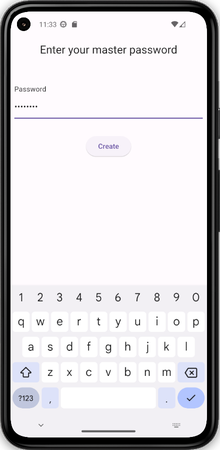
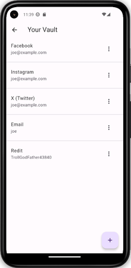
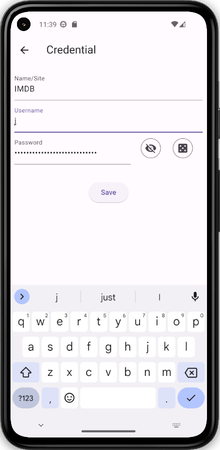

# Password Manager

An app demonstrating the use of BLoC pattern in context of a password-manager.

Topic covered:

- State management with BLoC
- Immutable collections
- Cryptography
- Local persistence
- JSON serialization
